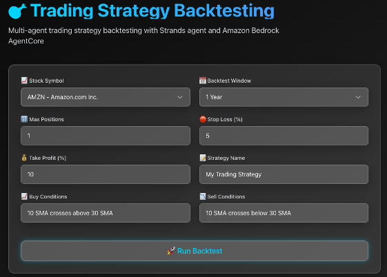
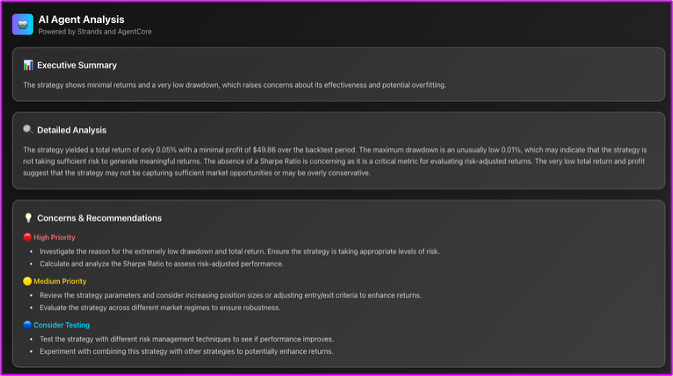
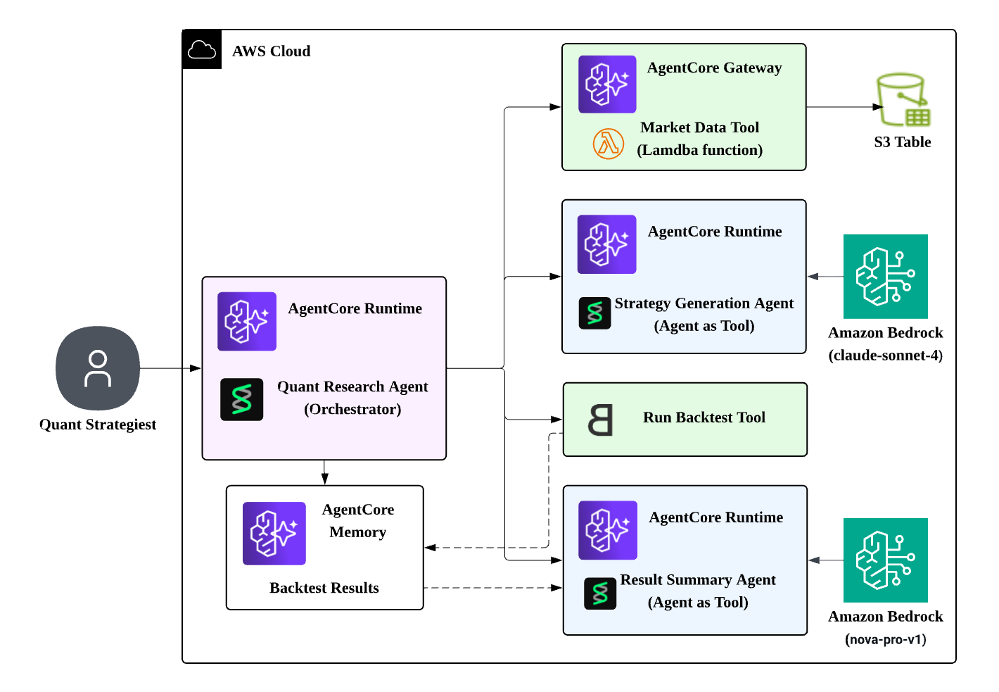

# Agentic Backtesting - Multi-Agent Strategy Backtesting System

A multi-agent system built with Strands for automated trading strategy development and backtesting using historical market data.

## Overview

### User Interface

The system provides an intuitive web interface for submitting trading ideas and viewing results:

**Agent Input:**

**Backtest Results:**

**Strategy Review & Recommendations:**

### System Components

This system uses 4 specialized agents orchestrated through Strands to transform trading ideas into backtested strategies:

1. **Strategy Generator Agent** - Converts natural language trading ideas into executable Backtrader strategies
2. **Market Data Tool** - Fetches historical market data from S3 Table
3. **Backtest Tool** - Executes backtests using Backtrader framework
4. **Results Summary Agent** - Analyzes performance and generates comprehensive reports

### Technology Stack

This project leverages **Strands Agent SDK** and **Amazon Bedrock AgentCore** to build a multi-agent backtesting system:

- **Strands Agent SDK**: A Python framework for building agentic applications with tool-calling capabilities. Strands provides decorators like `@tool` to easily expose Python functions as agent tools, enabling seamless integration between agents and external services.

- **AgentCore Runtime**: A managed service for deploying and orchestrating AI agents at scale. AgentCore handles agent runtime management, memory persistence, and secure communication between agents through its Gateway service with Cognito authentication.

- **AgentCore Gateway with MCP**: The Market Data Gateway implements the Model Context Protocol (MCP) to provide standardized access to external data sources. It uses Cognito for authentication and connects to Lambda functions that query S3 Tables for historical market data.

## Architecture

## Deployment

For complete deployment instructions, please refer to **[DEPLOYMENT_GUIDE.md](./DEPLOYMENT_GUIDE.md)**.

The deployment guide covers:
- Prerequisites and required tools
- Market Data MCP tool setup with Cognito authentication
- Step-by-step backend agent deployment (Strategy Generator, Result Summarizer, Quant Agent)
- Frontend deployment instructions

## Agent Details

### Orchestrator Agent (Strands)
- Coordinates all agents using Strands framework
- Handles timing and data flow between agents
- Provides unified interface for user interactions
- Deploy to Agentcore Runtime

### Strategy Generator Agent
- Converts natural language to Backtrader strategy code
- Generates executable Python code with proper indicators
- Template-based approach for consistent strategy structure
- Deploy to Agentcore Runtime

### Market Data Tool  
- Connects to S3 Table for historical data
- Deploy to Agentcore Gateway

### Backtest Tool
- Executes strategies using Backtrader framework
- Configurable parameters (initial cash, commission, etc.)
- Returns comprehensive performance metrics

### Results Summary Agent
- Analyzes backtest performance metrics
- Provides performance assessment and recommendations
- Deploy to Agentcore Runtime