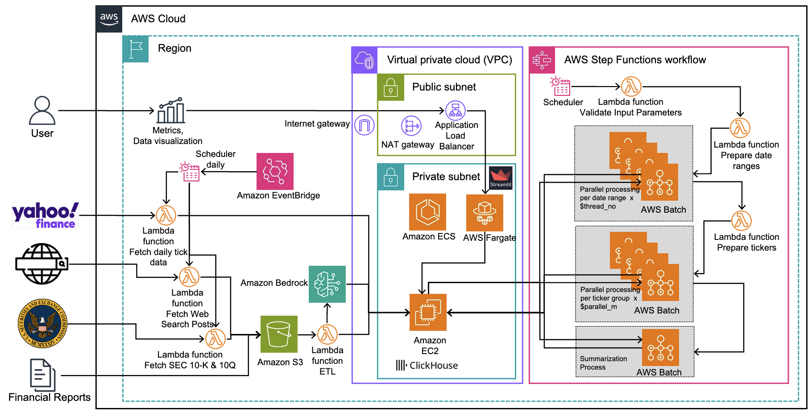

# Factor Mining Platform

This repository contains infrastructure code and application code for a comprehensive factor mining platform on AWS.

## Architecture

The platform consists of several components:
1. **Data Storage**: Clickhouse database and S3 buckets
2. **Data Collection**: Lambda functions to collect market data, SEC filings, financial reports, and web search results
3. **Processing**: AWS Step Functions and AWS Batch for factor mining
4. **Visualization**: Streamlit application for visualizing results



## Repository Structure

- `terraform/`: Terraform code for provisioning AWS resources
  - `0-prepare/`: Initial setup and prerequisites
  - `1-networking/`: VPC, subnets, and networking components
  - `2-clickhouse/`: Clickhouse database infrastructure
  - `3-jump-host/`: Jump host for secure access to resources
  - `4-market-data/`: Market data collection resources
  - `5-web-search/`: Web search data collection resources
  - `6-sec-filing/`: SEC filings data collection resources
  - `7-financial-report/`: Financial report processing resources
  - `8-factor-mining/`: Factor mining infrastructure
  - `9-visualization/`: Visualization application infrastructure
  - `modules/`: Reusable Terraform modules
  - `deployAll.sh`: Script to deploy all modules
  - `destroyAll.sh`: Script to destroy all resources

- `src/`: Application source code
  - `market-data/`: Market data collection code
  - `sec-filing/`: SEC filings data collection code
  - `web-search/`: Web search data collection code
  - `factor-modeling-model/`: Factor modeling algorithms and models
  - `step-function/`: AWS Step Functions workflow definitions
  - `visualization/`: Streamlit visualization application
  - `financial-report-processor/`: Financial report processing code


## Deployment

The platform is designed to be deployed in modules, allowing customers to choose which components to deploy.

### Prerequisites
- AWS account
- Terraform 1.0+
- Python 3.12
- AWS CLI configured

### Deployment Steps

The modules should be deployed in the following order to ensure dependencies are satisfied:

* Prepared lambda layers
* Networking
* Clickhouse
* Jump host (requires networking and ClickHouse to be deployed first) 
* 5-7. Data collection modules (can be deployed independently)
* Factor mining
* Visualization


1. Prepare the environment with Lambda layers:
   ```
   cd terraform/0-prepare
   ./deploy.sh
   ```

2. Deploy base networking:
   ```
   cd terraform/1-networking
   ./deploy.sh
   ```

3. Deploy Clickhouse:
   ```
   cd terraform/2-clickhouse
   ./deploy.sh
   ```

4. Deploy jump host for secure access to Clickhouse:
   ```
   cd terraform/3-jump-host
   ./deploy.sh
   ```

5. Deploy data collection modules to calculate factors:
   ```
   # Market data
   cd terraform/4-market-data
   ./deploy.sh

   # Web search
   cd terraform/5-web-search
   ./deploy.sh

   # SEC filing
   cd terraform/6-sec-filing
   ./deploy.sh

   # Deploy financial report processor
   cd terraform/7-financial-report
   ./deploy.sh
   ```

6. Deploy factor mining process:
   ```
   cd terraform/8-factor-mining
   ./deploy.sh
   ```

7. Deploy visualization:
   ```
   cd terraform/9-visualization
   ./deploy.sh
   ```

### Clean up

You can go to the folder you deployed, and run
```
terraform destroy
```

Alternatively, you can use the provided script to deploy and destroy all modules:
```
./terraform/deployAll.sh
or
./terraform/destroyAll.sh
```


### Best Practices

- Use remote state for production deployments
- Use variables for customization
- Follow the principle of least privilege for IAM roles
- Tag all resources appropriately
- Use consistent naming conventions