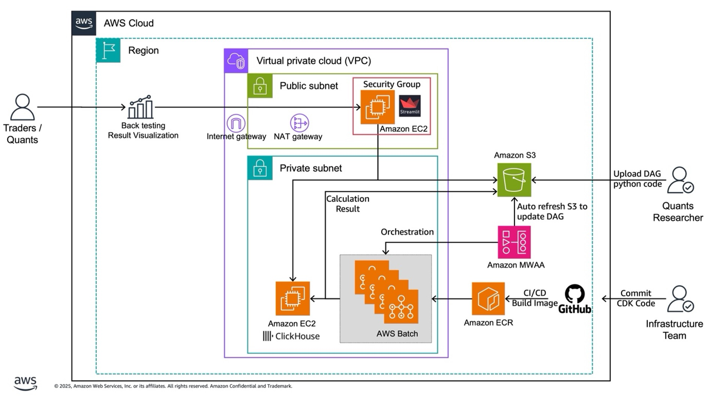

# Factor Trading Strategies Framework

This project provides a generic framework for creating and backtesting trading strategies using AWS MWAA (Managed Workflows for Apache Airflow) and AWS Batch. The framework leverages factors defined in the factor-mining project to create various trading strategies.

## Project Structure

```
factor-trading/
├── README.md
├── requirements.txt
├── .env.example
├── .gitignore
├── local_backtest.py
├── src/
│   ├── trading_strategies_model/
│   ├── frontend/
│   ├── dags/
│   ├── data_prepare/
│   └── batch_jobs/
├── scripts/
│   ├── 1.test_docker_build.sh
│   ├── 2.build_and_push_ecr.sh
│   ├── 3.deploy_batch_mwaa.sh
│   ├── 4.deploy_dag.sh
│   └── 5.deploy_frontend.sh
├── docker/
│   ├── Dockerfile
│   ├── requirements.txt
│   └── .dockerignore
└── cdk/
    ├── app.py
    ├── cdk.json
    ├── requirements.txt
    ├── frontend_stack.py
    ├── trading_strategies/
    └── frontend/
```

## Features

- Generic framework for implementing various trading strategies
- Long-Short Equity strategy implementation
- Backtesting engine using Backtrader
- Strategy execution workflow using AWS MWAA
- Enhanced AWS Batch environment based on [AWS Quant Research Sample](https://github.com/aws-samples/quant-research-sample-using-amazon-ecs-and-aws-batch) single node CPU implementation
- Integration with factor-mining project for factor data
- AWS CDK infrastructure as code for AWS resources
- AWS Glue Data Catalog and Athena for querying backtest results
- Risk management with take-profit and stop-loss mechanisms
- Cooldown periods to prevent excessive trading after exits
- Parallel backtesting with AWS Batch for parameter optimization


## Infrastructure

The project uses the following AWS services:
- Amazon MWAA (Managed Workflows for Apache Airflow)
- AWS Batch for compute-intensive backtesting
- Amazon S3 for backtesting result storage
- Amazon ClickHouse for data storage and analysis

### Architecture Overview



### 📋 **Prerequisites**

- AWS CLI configured with appropriate permissions
- Docker installed and running
- Python 3.11+ with virtual environment
- ClickHouse connection details (for data access)

### Requirements for existing VPC 

- Must have both public and private subnets
- Private subnets should have NAT Gateway access for internet connectivity
- Must be in the same region as your deployment


## Development Procedures

This section provides a complete development workflow for implementing and deploying trading strategies using this framework.

### Step 1: Local Development and Testing

#### 1.1 Set Up Local Environment

```bash
# Clone the repository
git clone <repository-url>
cd factor-trading

# Create and activate virtual environment
python3 -m venv venv
source venv/bin/activate  # On Windows: venv\Scripts\activate

# Install dependencies
pip install -r requirements.txt

# Set up environment variables
cp .env.example .env
# Edit .env with your ClickHouse connection details
```

#### 1.2 Develop Your Trading Strategy

Create your custom strategy by extending the base strategy class:

```python
# Example: src/trading_strategies_model/strategies/my_custom_strategy.py
from .base_strategy import BaseStrategy

class MyCustomStrategy(BaseStrategy):
    def __init__(self, **kwargs):
        super().__init__(**kwargs)
        # Initialize your strategy parameters
    
    def next(self):
        # Implement your trading logic
        pass
```

#### 1.3 Test Locally with local_backtest.py

Before deploying to AWS, thoroughly test your strategy locally:

```bash
# Basic backtest
python local_backtest.py --start-date 2022-01-01 --end-date 2022-12-31

# Advanced backtest with risk management
python local_backtest.py \
    --start-date 2022-01-01 \
    --end-date 2022-12-31 \
    --strategy MyCustomStrategy \
    --take-profit 10 \
    --stop-loss 5 \
    --cooldown-period 5 \
    --initial-capital 1000000

# Test different parameter combinations
python local_backtest.py --start-date 2020-01-01 --end-date 2023-12-31 --rebalance-period 7
```

**Local Testing Checklist:**
- [ ] Strategy logic works correctly
- [ ] Risk management parameters are appropriate
- [ ] Performance metrics meet expectations
- [ ] No runtime errors or exceptions
- [ ] Results are saved to `backtest_results/` directory

### Step 2: Docker Containerization of Trading Stategy

#### 2.1 Build and Push to ECR

Deploy your tested strategy to Amazon ECR:

```bash
# Run from project root directory, Test Docker Build Locally
./scripts/1.test_docker_build.sh 

# Using default ECR repository
./scripts/2.build_and_push_ecr.sh

# Using custom ECR repository
./scripts/2.build_and_push_ecr.sh --repo YOUR_AWS_ACCOUNT.dkr.ecr.REGION.amazonaws.com/YOUR_REPO --tag v1.0

# With timestamp tagging
./scripts/2.build_and_push_ecr.sh --timestamp
```

**Expected Output:**
```
✅ ECR authentication successful
✅ ECR repository 'backtest1' already exists
✅ Docker image built successfully
✅ Docker image pushed successfully to YOUR_AWS_ACCOUNT.dkr.ecr.us-east-1.amazonaws.com/backtest1:latest
```

**Important:** The script outputs the full ECR image URI which will be automatically used by the deployment script in Phase 3.

### Step 3: AWS Infrastructure Deployment with Batch and MWAA

Deploy your AWS infrastructure using the automated deployment script:

```bash
# Basic deployment (auto-detects ECR image from Phase 2)
./scripts/3.deploy_batch_mwaa.sh --image-uri YOUR_AWS_ACCOUNT.dkr.ecr.REGION.amazonaws.com/YOUR_REPO:latest

# Deployment with existing VPC, such as vpc-0dae208a35ee2453f
./scripts/3.deploy_batch_mwaa.sh --existing-vpc vpc-0dae208a35ee2453f 

# Force CDK bootstrap
./scripts/3.deploy_batch_mwaa.sh --bootstrap

```

The script will:
- Auto-detect the ECR image URI from Phase 2
- Set up CDK environment and dependencies
- Bootstrap CDK (if requested)
- Deploy AWS Batch, MWAA, and supporting infrastructure
- Verify the deployment
- Optionally submit a test job

**Deployment Options:**
- `--image-uri`: Specify custom ECR image URI
- `--existing-vpc`: Use existing VPC instead of creating new one
- `--bootstrap`: Force CDK bootstrap (required for first deployment)
- `--help`: Show all available options

### Step 4: Deploy DAG to MWAA

Deploy your backtest framework DAGs to the MWAA environment using the comprehensive deployment script:

```bash
# Basic deployment (auto-detects MWAA environment and S3 bucket)
./scripts/4.deploy_dag.sh

# Deployment with specific parameters
./scripts/4.deploy_dag.sh --environment-name TradingStrategiesMwaaEnvironment --region us-east-1

# Preview deployment without making changes
./scripts/4.deploy_dag.sh --dry-run

# Deploy without configuration guidance
./scripts/4.deploy_dag.sh --no-variables
```

**What the script deploys:**
- `framework_backtest_simple_example_dag.py` - Single strategy backtest DAG
- `framework_backtest_multi_example_dag.py` - Multi-parameter backtest DAG  
- `airflow_backtest_framework/` - Complete framework directory
- `requirements.txt` - Python dependencies (if present)

**Post-deployment configuration:**
After successful deployment, configure these Airflow Variables in the MWAA UI:
- `batch_job_queue` - AWS Batch job queue name
- `batch_job_definition` - Batch job definition name
- `trading_strategies_bucket` - S3 results bucket
- Database connection parameters (`db_host`, `db_port`, `db_user`, `db_password`, `db_database`)

The script provides verification, displays the MWAA web UI URL, and guides you through the complete setup process for running backtest workflows.

### Step 5: Deploy Frontend Dashboard

Deploy an interactive Streamlit dashboard to manage backtests and analyze results:

```bash
# Automated deployment with existing VPC, such as vpc-0dae208a35ee2453f
./scripts/5.deploy_frontend.sh vpc-0dae208a35ee2453f

# And with an IP to whitelist the access to the dashboard
./scripts/5.deploy_frontend.sh vpc-xxxxxxxxx 1.2.3.4

# Manual CDK deployment
cd cdk
python3 -m venv venv && source venv/bin/activate
pip install -r ../requirements.txt
cdk deploy -c existing_vpc_id=vpc-xxxxxxxxx -c your_ip=1.2.3.4
```

**What you get:**
- Interactive web dashboard at `http://INSTANCE_IP:8502`
- Unified frontend for backtest management and results visualization
- Performance analysis with charts and metrics
- Best performers identification across strategies
- Detailed backtest, orders, and trades analysis
- Secure access (restricted to your IP only)


**Dashboard features:**
- Overview metrics and performance charts
- Filterable backtest results table
- Drill-down views for individual strategies
- Symbol performance analysis
- Trade patterns and exit reasons

The dashboard automatically connects to your ClickHouse database and provides comprehensive analysis tools for optimizing your trading strategies.

### Production Operations

#### Strategy Updates

When updating your trading strategies:

```bash
# 1. Test locally
python local_backtest.py --strategy UpdatedStrategy --start-date 2023-01-01 --end-date 2023-12-31

# 2. Build and push new Docker image
./scripts/2.build_and_push_ecr.sh --tag v2.0

# 3. Deploy updated infrastructure
./scripts/3.deploy_batch_mwaa.sh --image-uri YOUR_NEW_ECR_URI
```

#### Monitoring and Troubleshooting

```bash
# View CloudWatch logs
aws logs describe-log-groups --log-group-name-prefix "/factor-trading"

# Check job status
aws batch list-jobs --job-queue factor-trading-job-queue-00

# Debug failed jobs
aws batch describe-jobs --jobs JOB_ID
```


## Backtesting Framework

This project uses Backtrader, a popular open-source Python framework for backtesting trading strategies. Backtrader provides:

- Event-driven architecture
- Flexible strategy development
- Built-in analyzers and performance metrics

## Risk Management Features

### Take-Profit and Stop-Loss

The framework includes configurable take-profit and stop-loss mechanisms:
- Take-profit: Automatically exits a position when it reaches a specified profit percentage
- Stop-loss: Automatically exits a position when it reaches a specified loss percentage

### Cooldown Period

To prevent excessive trading and reduce transaction costs, the framework includes a cooldown period feature:
- After a position is closed due to take-profit or stop-loss, the security enters a cooldown period
- During the cooldown period, the strategy will not re-enter a position in that security
- The cooldown period is configurable in days

## Parallel Backtesting with AWS Batch

The framework leverages AWS Batch for parallel backtesting:
- Multiple parameter combinations can be tested simultaneously
- AWS MWAA orchestrates the parallel execution of AWS Batch jobs
- Parameters that can be varied include:
  - Take-profit and stop-loss thresholds
  - Rebalance periods
  - Cooldown periods
  - Strategy-specific parameters (e.g., long/short percentages)
- Results are stored in S3 for analysis

## Adding New Strategies

To add a new strategy:

1. Create a new Python file in `src/trading-strategies-model/strategies/`
2. Extend the `BaseStrategy` class
3. Implement the required methods
4. Register the strategy in the Airflow DAG

See `src/trading-strategies-model/strategies/long_short_equity.py` for an example implementation.


## Acknowledgments

This project's AWS Batch implementation is based on the single node CPU implementation from the [AWS Quant Research Sample](https://github.com/aws-samples/quant-research-sample-using-amazon-ecs-and-aws-batch) repository. We have adapted and enhanced their robust batch environment design to support factor trading strategy backtesting and execution workflows.

The original AWS sample provides excellent patterns for:
- Comprehensive IAM role and policy management
- Production-ready AWS Batch compute environments
- Cost-optimized resource allocation with spot instances
- Scalable job queue management
- Integration with AWS services like S3, Glue, and CloudWatch